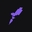

# "O aprendizado é contínuo e o próximo nível nunca será o último" - Rocketseat

## Sobre mim
Olá, meu nome é **Bruno**, atuo profissionalmente como desenvolvedor de software e eu sou apaixonado por jogos.

## Stack atual

## Estudando

## Tenho interesse

## DevOps

## Ferramentas

## Minhas redes

  

## Github Stats

  

  

